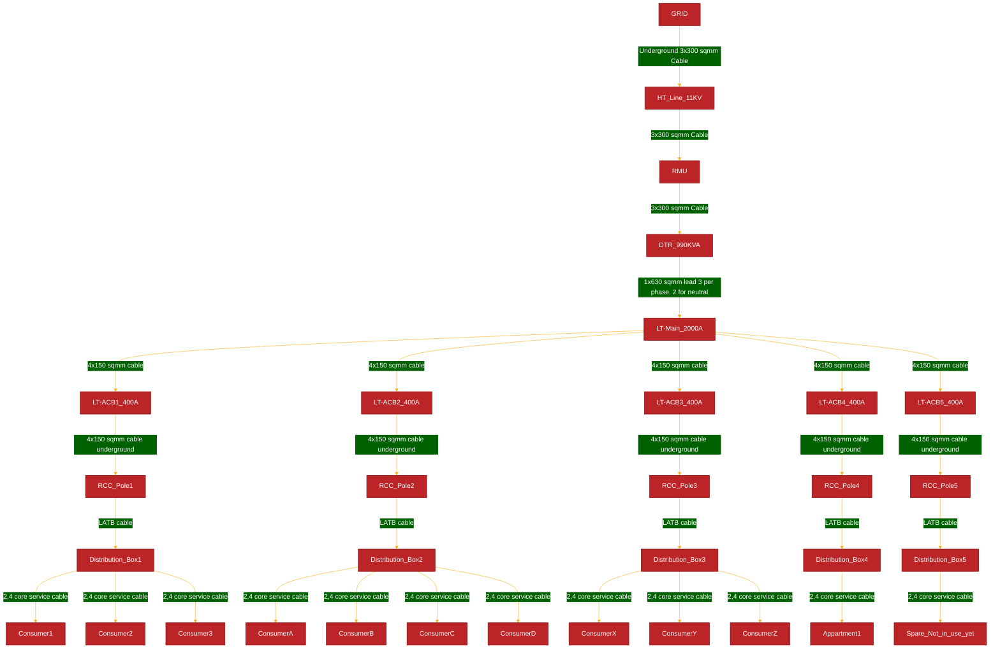

```mermaid

%%{
  init: {
    'theme': 'base',
    'themeVariables': {
      'primaryColor': '#BB2528',
      'primaryTextColor': '#fff',
      'primaryBorderColor': '#7C0000',
      'lineColor': '#F8B229',
      'secondaryColor': '#006100',
      'tertiaryColor': '#fff'
    }
  }
}%%

  graph TD;

  GRID ---> |Underground 3x300 sqmm Cable| HT_Line_11KV;
  HT_Line_11KV --->|3x300 sqmm Cable| RMU;
  RMU --->|3x300 sqmm Cable| DTR_990KVA;
  DTR_990KVA ---> |1x630 sqmm lead 3 per phase, 2 for neutral| LT-Main_2000A;
  LT-Main_2000A ---> |4x150 sqmm cable| LT-ACB1_400A;
  LT-Main_2000A ---> |4x150 sqmm cable| LT-ACB2_400A;
  LT-Main_2000A ---> |4x150 sqmm cable| LT-ACB3_400A;
  LT-Main_2000A ---> |4x150 sqmm cable| LT-ACB4_400A;
  LT-Main_2000A ---> |4x150 sqmm cable| LT-ACB5_400A;
  LT-ACB1_400A ---> |4x150 sqmm cable underground| RCC_Pole1;
  LT-ACB2_400A ---> |4x150 sqmm cable underground| RCC_Pole2;
  LT-ACB3_400A ---> |4x150 sqmm cable underground| RCC_Pole3;
  LT-ACB4_400A ---> |4x150 sqmm cable underground| RCC_Pole4;
  LT-ACB5_400A ---> |4x150 sqmm cable underground| RCC_Pole5;
  RCC_Pole1 ---> |LATB cable| Distribution_Box1;
  Distribution_Box1 ---> |2,4 core service cable| Consumer1;
  Distribution_Box1 ---> |2,4 core service cable| Consumer2;
  Distribution_Box1 ---> |2,4 core service cable| Consumer3;
  RCC_Pole2 ---> |LATB cable| Distribution_Box2;
  Distribution_Box2 ---> |2,4 core service cable| ConsumerA;
  Distribution_Box2 ---> |2,4 core service cable| ConsumerB;
  Distribution_Box2 ---> |2,4 core service cable| ConsumerC;
  Distribution_Box2 ---> |2,4 core service cable| ConsumerD;
  RCC_Pole3 ---> |LATB cable| Distribution_Box3;
  Distribution_Box3 ---> |2,4 core service cable| ConsumerX;
  Distribution_Box3 ---> |2,4 core service cable| ConsumerY;
  Distribution_Box3 ---> |2,4 core service cable| ConsumerZ;
  RCC_Pole4 ---> |LATB cable| Distribution_Box4;
  Distribution_Box4 ---> |2,4 core service cable| Appartment1;
  RCC_Pole5 ---> |LATB cable| Distribution_Box5;
  Distribution_Box5 ---> |2,4 core service cable| Spare_Not_in_use_yet;


```
